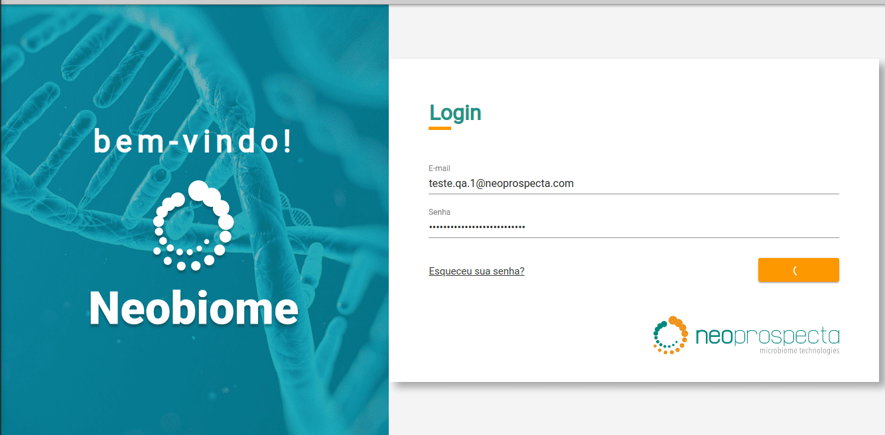

# Teste Neoprospecta

### **Ferramenta**

A automação foi construída com [Robot Framework](https://robotframework.org/) a partir da [SeleniumLibrary](https://robotframework.org/SeleniumLibrary/SeleniumLibrary.html). 

Robot Framework é uma ferramenta de automação de testes que faz uma abstração das linguagens de programação através das chamadas "keywords"/"palavras chaves", deixando a sua manipulação mais próximo da linguagem humana. Dentro do universo Robot, é a partir da SeleniumLibrary que se constrói manipulação dos elementos web. 

****

### **Objetivo**

Como cliente da Neoprospecta preciso criar filtros taxonômicos (com microrganismos) podendo adicionar vários níveis dentro (ex: espécie, gênero, família, etc) para que eu possa visualizar no resultado rapidamente as taxonomias mais interessantes para mim.

****

### **Como executar**

**1. Python**

Tenha o Python instalado em seu computador. 
Caso ainda não tenha, acesse [python.org](https://www.python.org/).

**2. Para instalar o Robot Framework**

Digite em seu prompt de comando: `pip install robot framework` 

 Em seguida, digite: `pip install SeleniumLibrary`

**3. Baixar Webdriver**

Confirme a versão do Chrome em seu computador e baixe a versão compatível em [chromedriver](https://chromedriver.chromium.org/downloads). Extraia o arquivo em sua pasta C:

**4. Clonar o projeto**

`git clone git@github.com:marinagiaquinto/teste_neoprospecta.git`

**5. Executar o projeto**

Em seu prompt de comando vá até o diretório raiz do projeto e digite:

`robot -d results tests/tests.robot`

